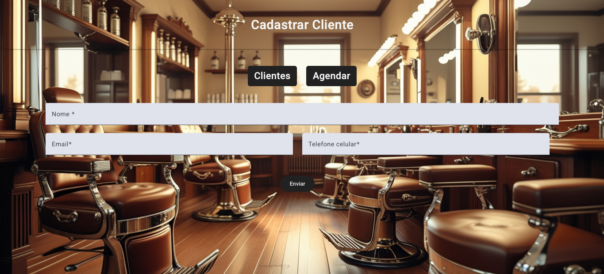
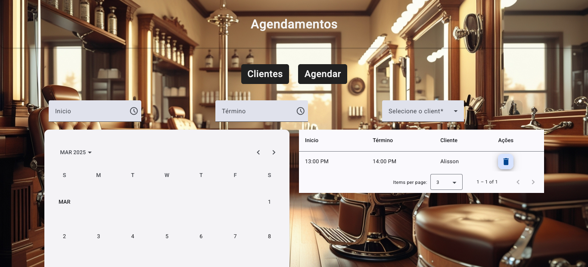

# Barber Shop Platform

Uma plataforma para agendamentos de atendimentos em uma barbearia.

## 🚀 Como rodar o projeto

1. Clone o repositório com os submódulos:
   ```bash
   git clone --recurse-submodule https://github.com/AlissonLimaG/barber-shop-platform.git
   ```

2. Acesse o diretório do projeto:
   ```bash
   cd barber-shop-platform
   ```

3. Execute o Docker Compose para iniciar os serviços:
   ```bash
   docker compose up --build
   ```

## 📸 Capturas de Tela

### Página Inicial


### Tela de Agendamento



